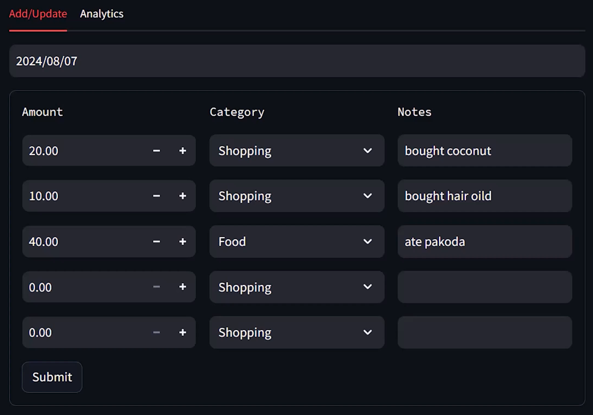
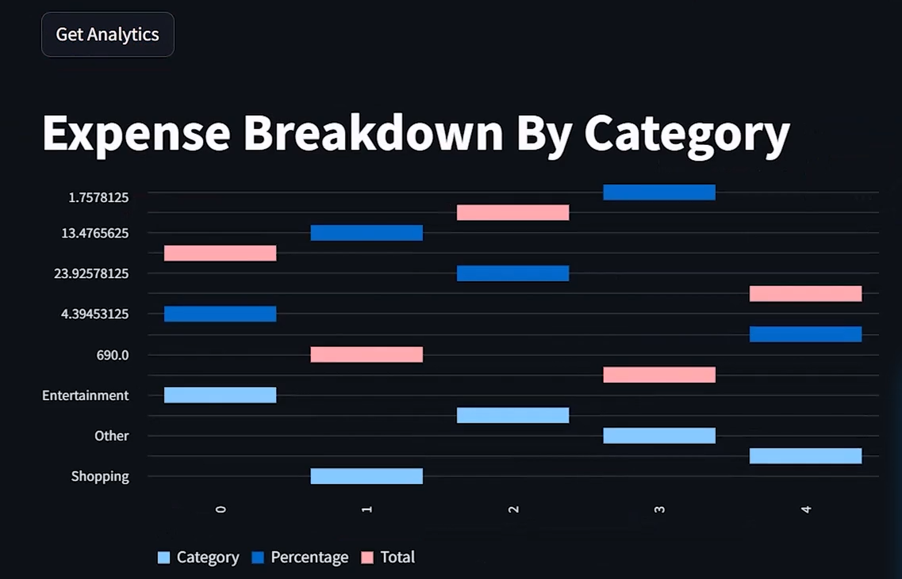
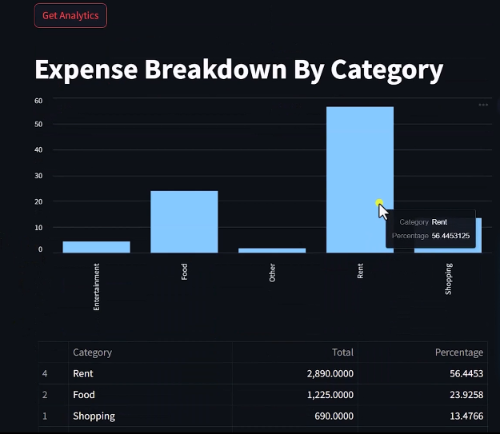

# Expense Management System

This project is an Expense Management System consisting of a Streamlit frontend application and a FastAPI backend server.

---

## Project Structure

- **frontend/**: Contains the Streamlit application code for the user interface.
- **backend/**: Contains the FastAPI backend server code to handle API requests.
- **tests/**: Contains the test cases for both frontend and backend components.
- **requirements.txt**: Lists all the required Python packages for the project.
- **README.md**: Provides an overview and setup instructions for the project.

---

## Features

- **Track Expenses:** Add, view, and categorize expenses.
- **Real-time Updates:** Synchronization between frontend and backend.
- **User-friendly Interface:** Simple and intuitive design using Streamlit.
- **API Integration:** Powered by a robust FastAPI backend.
- **Testing Support:** Unit tests for ensuring code quality.

---

## Setup Instructions

### Prerequisites
Ensure that Python 3.12.6 or a compatible version is installed on your system.

### Steps

1. **Clone the repository:**
   ```bash
   git clone https://github.com/yourusername/expense-management-system.git
   cd expense-management-system
   ```

2. **Install dependencies:**
   Install the required Python packages using:
   ```bash
   pip install -r requirements.txt
   ```

3. **Run the FastAPI server:**
   Navigate to the backend folder and start the server:
   ```bash
   uvicorn backend.main:app --reload
   ```

4. **Run the Streamlit app:**
   Navigate to the frontend folder and start the application:
   ```bash
   streamlit run frontend/app.py
   ```

5. **Access the application:**
   - The FastAPI server will be available at `http://127.0.0.1:8000`.
   - The Streamlit frontend can be accessed at `http://localhost:8501`.

---

## Testing

To run the test cases for both the frontend and backend, use:
```bash
pytest tests/
```


